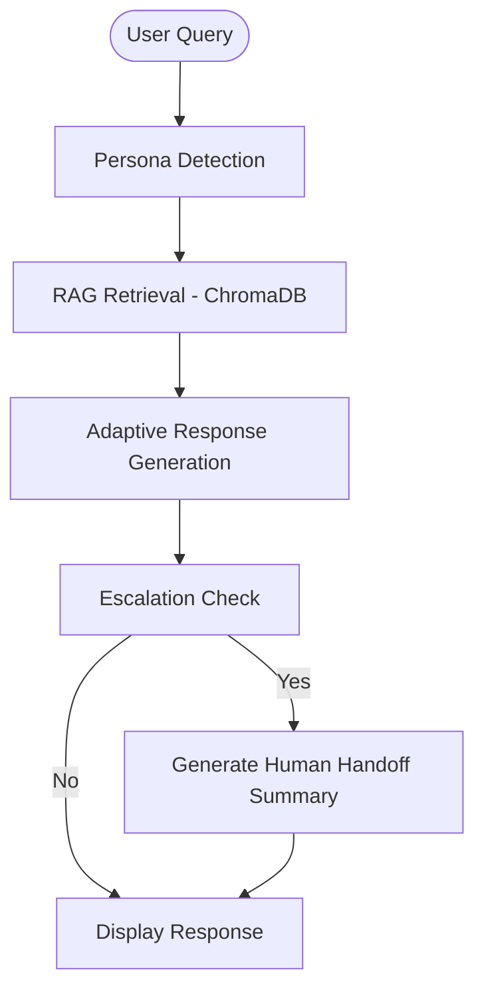

# CloudSpark AI Support: Persona-Adaptive Agent

## Project Overview
CloudSpark AI Support is a state-of-the-art customer support system built using LLMs (Gemini), Retrieval-Augmented Generation (RAG), and adaptive communication strategies. The system identifies user personas (Technical Expert, Frustrated User, Business Executive) and tailors its responses to match their specific needs and expectations while grounding all information in a private knowledge base.

## Tech Stack
- **Language:** Python 3.11+
- **LLM:** Google Gemini 2.0 Flash
- **Embeddings:** Google Gemini Embedding 2 (`gemini-embedding-2`)
- **Orchestration:** LangChain
- **Vector Database:** ChromaDB
- **UI:** Gradio
- **Documents:** PDF, Markdown, TXT

## Architecture Diagram


## Persona Detection Strategy
The system uses **Zero-Shot LLM Classification** to categorize users.
- **Method:** Each incoming query is first passed to Gemini with a specialized prompt describing the three personas.
- **Prompt Design:** The prompt provides clear definitions and typical characteristics for Technical, Frustrated, and Business personas.
- **Schema:** The detection output is parsed into a structured JSON format containing the persona and the reasoning behind it.

## RAG Pipeline Design
- **Ingestion:** Supports multi-format loading (PDF, TXT, MD) from the `/data` directory.
- **Chunking:** Uses `RecursiveCharacterTextSplitter` with a chunk size of 1000 and 200 character overlap to maintain context.
- **Vector DB:** ChromaDB stores the embeddings generated by Gemini.
- **Retrieval:** Similarity search with relevance scores ensures only high-quality context is used for generation.

## Escalation Logic
Conversations are escalated based on three configurable triggers:
1. **Low Confidence:** If the similarity score of retrieved documents falls below a threshold (default 0.5).
2. **Sensitive Topics:** Detecting keywords related to billing, legal, or security breaches.
3. **Persistant Frustration:** If a user remains in a "Frustrated" persona for multiple turns.

## Setup Instructions
1. **Clone the repository:**
   ```bash
   git clone <repo_url>
   cd ragProject
   ```
2. **Install dependencies:**
   ```bash
   pip install -r requirements.txt
   ```
3. **Set up Environment Variables:**
   Create a `.env` file and add your Google API Key:
   ```
   GOOGLE_API_KEY=your_api_key_here
   ```
4. **Generate Sample Data:**
   ```bash
   python scratch/generate_data.py
   ```
5. **Run the Application:**
   ```bash
   python app.py
   ```

## Example Queries
1. **Technical:** "How do I implement signature verification for webhooks? Please explain the process in detail."
2. **Frustrated:** "I've been trying to reset my password for an hour and the link never arrives! This is unacceptable!"
3. **Business:** "What is the uptime SLA for the Pro tier and how does it affect our core operations?"
4. **General:** "What are your pricing tiers?"
5. **Escalation:** "I need a refund for my last invoice immediately."

## Known Limitations
- **Memory:** Current implementation uses a simplified session history; long-term memory via database (SQLite/Redis) is not yet implemented.
- **Streaming:** Gradio UI doesn't currently use streaming for response generation (can be added).
- **Concurrency:** ChromaDB is running in ephemeral mode; for production, a centralized vector DB like Pinecone/Qdrant should be used.
